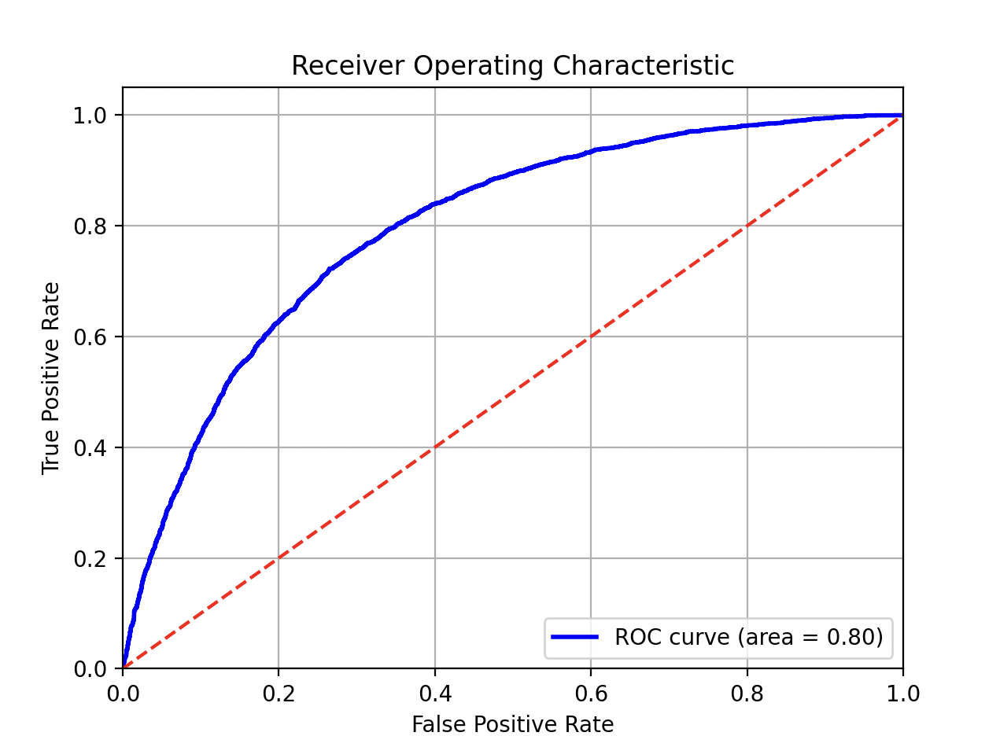

# Binomial Logistic Regression for News Article Classification

## Project Overview
This project focuses on binary classification of news articles into two categories:
1. **Functional and Contextual Articles**
2. **Emotional and Actional Articles**

The goal was to develop a model capable of accurately distinguishing between these two classes using Natural Language Processing (NLP) techniques and machine learning, specifically binomial logistic regression.

## Dataset
- **Source**: Manually labeled collection of 40,000 news articles.
- **Class Imbalance**: The dataset had an imbalance, with more Functional and Contextual articles compared to Emotional and Actional ones.

## Feature Engineering
We used various techniques to extract features from the text data:
- **SpaCy**: For basic text processing (word count, character count, sentence count, average word length).
- **TextDescriptives**: Additional statistical descriptions like sentence complexity and text entropy.
- **Named Entity Recognition (NER)**: Identified key entities (people, locations, organizations) using SpaCy.

## Data Processing
To address the class imbalance, we applied oversampling techniques:
- **SMOTE (Synthetic Minority Over-sampling Technique)** and **Tomek Links** were used to balance the dataset and reduce overfitting risks.

## Model Training
We trained a **binomial logistic regression** model using an 80/20 train-test split:
- Logistic regression was chosen for its simplicity and efficiency for binary classification tasks.
- **SMOTETomek** was applied to the training set to handle class imbalance.

## Cross-Validation
We used **5-fold cross-validation** to assess model robustness and detect overfitting.

## Model Evaluation
The model was evaluated using the following metrics:
- **ROC AUC**: The model achieved an AUC of 0.8, indicating strong class separation.
- **Accuracy**: The model had an accuracy of 73% on the test set (71% on a subset of 4000 articles).

## Results
- **Final Accuracy**: 73%
- **AUC**: 0.8
- Experimental adjustments using undersampling techniques resulted in a slight drop in accuracy to 72%.

  

## Conclusion
The binomial logistic regression model proved to be an effective choice for binary classification of news articles. Techniques for balancing classes significantly improved model performance. The ROC curve for the best model confirms its effectiveness in distinguishing between the two classes.
